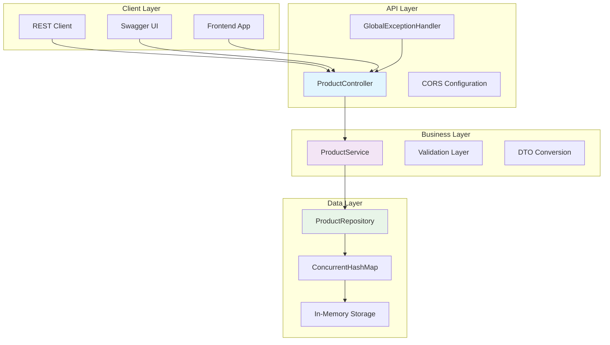
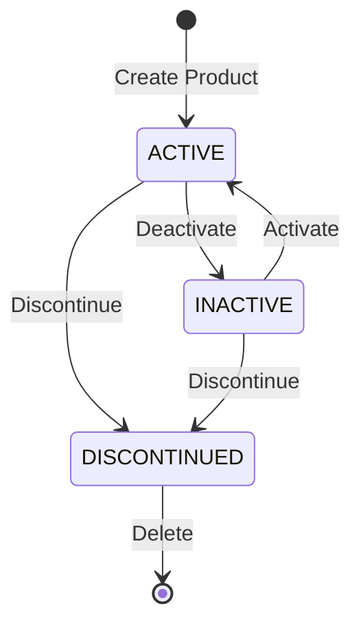

# 🛍️ Product Catalog Management API

<div align="center">


**A comprehensive Spring MVC REST API for Product Catalog Management**

[🚀 Quick Start](#-quick-start) • [📋 API Documentation](#-api-endpoints) • [🔧 Setup](#-setup--installation) • [📊 Examples](#-usage-examples)

</div>

---

## 🎯 Project Overview

This is a **Phase 2 Mini Project** demonstrating advanced Spring MVC concepts and REST API design patterns. The project showcases a complete product catalog management system with comprehensive validation, error handling, and modern API practices.

### 🏗️ System Architecture



### 🌟 Key Features

<table>
<tr>
<td width="50%">

#### 🔧 Core Operations
- ✅ **CRUD Operations** - Complete product lifecycle
- ✅ **Advanced Search** - Multi-criteria filtering
- ✅ **Stock Management** - Real-time inventory updates
- ✅ **Status Control** - Product lifecycle management
- ✅ **Data Validation** - Comprehensive input validation

</td>
<td width="50%">

#### 🚀 Technical Features
- ✅ **REST API Design** - RESTful endpoints
- ✅ **Exception Handling** - Global error management
- ✅ **API Documentation** - OpenAPI/Swagger integration
- ✅ **CORS Support** - Cross-origin resource sharing
- ✅ **Health Monitoring** - Actuator endpoints

</td>
</tr>
</table>

---

## 🛠️ Technology Stack

<div align="center">

| Component | Technology | Exact Version | Purpose |
|-----------|------------|---------------|---------|
| **🔧 Framework** | Spring Boot | `3.5.15` | Application framework |
| **🌐 Web Layer** | Spring MVC | `6.2.x` | REST API implementation |
| **☕ Runtime** | Java | `21` | Programming language |
| **📦 Build Tool** | Maven | `3.9+` | Dependency management |
| **✅ Validation** | Jakarta Bean Validation | `3.1` | Input validation |
| **📚 Documentation** | SpringDoc OpenAPI | `2.8.17` | API documentation |
| **📊 Monitoring** | Spring Actuator | `3.5.15` | Health & metrics |
| **💾 Storage** | ConcurrentHashMap | `Java 21` | In-memory data store |

</div>

---

## 📋 API Endpoints

### 🛍️ Product Management

<details>
<summary><b>Core CRUD Operations</b></summary>

| Method | Endpoint | Description | Request Body | Response |
|--------|----------|-------------|--------------|----------|
| `POST` | `/api/products` | Create new product | [`CreateProductRequest`](src/main/java/com/example/productcatalog/dto/CreateProductRequest.java) | [`ProductDTO`](src/main/java/com/example/productcatalog/dto/ProductDTO.java) |
| `GET` | `/api/products` | Get all products | None | `List<ProductDTO>` |
| `GET` | `/api/products/{id}` | Get product by ID | None | [`ProductDTO`](src/main/java/com/example/productcatalog/dto/ProductDTO.java) |
| `PUT` | `/api/products/{id}` | Update product | [`UpdateProductRequest`](src/main/java/com/example/productcatalog/dto/UpdateProductRequest.java) | [`ProductDTO`](src/main/java/com/example/productcatalog/dto/ProductDTO.java) |
| `DELETE` | `/api/products/{id}` | Delete product | None | `204 No Content` |

</details>

### 🔍 Search & Filter Operations

<details>
<summary><b>Advanced Search Capabilities</b></summary>

| Method | Endpoint | Description | Query Parameters |
|--------|----------|-------------|------------------|
| `GET` | `/api/products/search` | Multi-criteria search | `name`, `category`, `status`, `minPrice`, `maxPrice`, `sortBy` |
| `GET` | `/api/products/category/{category}` | Filter by category | None |
| `GET` | `/api/products/status/{status}` | Filter by status | None |

**Supported Sort Fields**: `name`, `price`, `createdAt`, `stockQuantity`

</details>

### ⚙️ Product Operations

<details>
<summary><b>Status & Stock Management</b></summary>

| Method | Endpoint | Description | Parameters |
|--------|----------|-------------|------------|
| `PATCH` | `/api/products/{id}/stock` | Update stock quantity | `stock` (query param) |
| `PATCH` | `/api/products/{id}/activate` | Activate product | None |
| `PATCH` | `/api/products/{id}/deactivate` | Deactivate product | None |
| `PATCH` | `/api/products/{id}/discontinue` | Discontinue product | None |

</details>

### 📊 Utility Endpoints

| Method | Endpoint | Description | Response |
|--------|----------|-------------|----------|
| `GET` | `/api/products/count` | Get total product count | `Long` |
| `GET` | `/api/products/{id}/exists` | Check if product exists | `Boolean` |

---

## 📊 Data Models

### 🏷️ Product Entity

```java
@Entity
public class Product {
    private Long id;                    // Auto-generated unique identifier
    private String name;               // 2-100 chars, unique, alphanumeric + spaces/hyphens
    private String description;        // Optional, max 500 characters
    private BigDecimal price;         // Positive value, max 2 decimal places
    private ProductCategory category; // Predefined enum values
    private Integer stockQuantity;    // Non-negative integer
    private ProductStatus status;     // ACTIVE, INACTIVE, DISCONTINUED
    private LocalDateTime createdAt;  // Auto-set on creation
    private LocalDateTime updatedAt;  // Auto-updated on modifications
}
```

### 📂 Product Categories

```java
public enum ProductCategory {
    ELECTRONICS,     // 📱 Electronic devices and gadgets
    CLOTHING,        // 👕 Apparel and fashion items
    BOOKS,           // 📚 Books and publications
    HOME_GARDEN,     // 🏠 Home and garden supplies
    SPORTS_OUTDOORS, // ⚽ Sports and outdoor equipment
    TOYS_GAMES,      // 🎮 Toys and gaming products
    HEALTH_BEAUTY,   // 💄 Health and beauty products
    AUTOMOTIVE,      // 🚗 Automotive parts and accessories
    FOOD_BEVERAGES,  // 🍕 Food and beverage items
    OFFICE_SUPPLIES  // 📎 Office and business supplies
}
```

### 🔄 Product Status Lifecycle



---

## 🔧 Setup & Installation

### 📋 Prerequisites

<table>
<tr>
<td>

**Required Software**
- ☕ **Java 21** or higher
- 📦 **Maven 3.9+**
- 🔧 **IDE** (IntelliJ IDEA, Eclipse, VS Code)

</td>
<td>

**System Requirements**
- 💾 **RAM**: 4GB minimum, 8GB recommended
- 💿 **Storage**: 500MB free space
- 🌐 **Network**: Internet connection for dependencies

</td>
</tr>
</table>

### 🚀 Quick Start

```bash
# 1️⃣ Clone the repository
git clone <repository-url>
cd product-catalog-management-main

# 2️⃣ Verify Java version
java --version
# Expected: openjdk 21.x.x or higher

# 3️⃣ Build the project
mvn clean compile

# 4️⃣ Run tests (optional)
mvn test

# 5️⃣ Start the application
mvn spring-boot:run
```

### 🌐 Access Points

Once the application is running, access these endpoints:

<div align="center">

| Service | URL | Description |
|---------|-----|-------------|
| 🏠 **API Base** | http://localhost:8080 | Main API endpoint |
| 📚 **Swagger UI** | http://localhost:8080/swagger-ui.html | Interactive API documentation |
| 📋 **API Docs** | http://localhost:8080/api-docs | OpenAPI specification |
| ❤️ **Health Check** | http://localhost:8080/actuator/health | Application health status |
| 📊 **Metrics** | http://localhost:8080/actuator/metrics | Application metrics |

</div>

---

## 📝 Usage Examples

### 🆕 Create a Product

```bash
curl -X POST http://localhost:8080/api/products \
  -H "Content-Type: application/json" \
  -d '{
    "name": "Wireless Bluetooth Headphones",
    "description": "Premium wireless headphones with active noise cancellation and 30-hour battery life",
    "price": 299.99,
    "category": "ELECTRONICS",
    "stockQuantity": 150
  }'
```

**Response:**
```json
{
  "id": 1,
  "name": "Wireless Bluetooth Headphones",
  "description": "Premium wireless headphones with active noise cancellation and 30-hour battery life",
  "price": 299.99,
  "category": "ELECTRONICS",
  "stockQuantity": 150,
  "status": "ACTIVE",
  "createdAt": "2024-01-15T10:30:00",
  "updatedAt": "2024-01-15T10:30:00"
}
```

### 🔍 Advanced Search Examples

```bash
# Search by name (case-insensitive)
curl "http://localhost:8080/api/products/search?name=wireless"

# Filter by category and price range
curl "http://localhost:8080/api/products/search?category=ELECTRONICS&minPrice=200&maxPrice=500"

# Get all products sorted by price (ascending)
curl "http://localhost:8080/api/products?sortBy=price"

# Complex search with multiple filters
curl "http://localhost:8080/api/products/search?category=ELECTRONICS&status=ACTIVE&minPrice=100&maxPrice=1000&sortBy=name"
```

### 📦 Stock Management

```bash
# Update stock quantity
curl -X PATCH "http://localhost:8080/api/products/1/stock?stock=200"

# Activate a product
curl -X PATCH "http://localhost:8080/api/products/1/activate"

# Deactivate a product
curl -X PATCH "http://localhost:8080/api/products/1/deactivate"

# Discontinue a product
curl -X PATCH "http://localhost:8080/api/products/1/discontinue"
```

---

## ✅ Validation Rules

<div align="center">

### 📝 Input Validation Matrix

| Field | Required | Min Length | Max Length | Pattern | Additional Rules |
|-------|----------|------------|------------|---------|------------------|
| **Name** | ✅ | 2 | 100 | `^[a-zA-Z0-9\s\-_]+$` | Must be unique |
| **Description** | ❌ | - | 500 | - | Optional field |
| **Price** | ✅ | - | - | - | > 0, max 2 decimals |
| **Category** | ✅ | - | - | Enum | Predefined values only |
| **Stock** | ✅ | - | - | - | >= 0 |

</div>

### 🚨 Validation Error Examples

<details>
<summary><b>Common Validation Scenarios</b></summary>

**Invalid Name (too short):**
```json
{
  "type": "https://api.productcatalog.com/errors/validation-failed",
  "title": "Validation Failed",
  "status": 400,
  "detail": "Validation failed for one or more fields",
  "instance": "/api/products",
  "timestamp": "2024-01-15T10:30:00",
  "errors": [
    {
      "field": "name",
      "rejectedValue": "A",
      "message": "Product name must be between 2 and 100 characters"
    }
  ]
}
```

**Invalid Price (negative):**
```json
{
  "errors": [
    {
      "field": "price",
      "rejectedValue": -10.50,
      "message": "Price must be positive"
    }
  ]
}
```

</details>

---

## 🚨 Error Handling

The API implements **RFC 7807 Problem Details** for standardized error responses:

### 📊 Error Response Structure

```json
{
  "type": "https://api.productcatalog.com/errors/{error-type}",
  "title": "Human-readable error title",
  "status": 400,
  "detail": "Detailed error description",
  "instance": "/api/products/{id}",
  "timestamp": "2024-01-15T10:30:00",
  "errors": [/* field-specific errors */]
}
```

### 🔍 Common Error Scenarios

<details>
<summary><b>HTTP Status Codes & Responses</b></summary>

| Status Code | Scenario | Example |
|-------------|----------|---------|
| `400 Bad Request` | Validation failure | Invalid input data |
| `404 Not Found` | Resource not found | Product ID doesn't exist |
| `409 Conflict` | Business rule violation | Duplicate product name |
| `500 Internal Server Error` | System error | Unexpected server error |

</details>

---

## 📊 Monitoring & Observability

### 🔍 Actuator Endpoints

<div align="center">

| Endpoint | Purpose | Response Format |
|----------|---------|-----------------|
| `/actuator/health` | Application health status | JSON health indicators |
| `/actuator/info` | Application information | JSON app metadata |
| `/actuator/metrics` | Application metrics | JSON metrics data |

</div>

### 📝 Logging Configuration

```properties
# Logging levels configured in application.properties
logging.level.com.example.productcatalog=DEBUG
logging.level.org.springframework.web=INFO
logging.level.org.springframework.validation=DEBUG

# Log file location
logging.file.name=logs/product-catalog-api.log
```

---

## 🔒 Security & Configuration

### 🌐 CORS Configuration

```java
@CrossOrigin(
    origins = "*",
    methods = {GET, POST, PUT, DELETE, PATCH, OPTIONS},
    maxAge = 3600
)
```

### ⚙️ Application Configuration

<details>
<summary><b>Key Configuration Properties</b></summary>

```properties
# Server Configuration
server.port=8080
spring.application.name=product-catalog-api

# Error Handling
spring.web.error.include-message=always
spring.web.error.include-binding-errors=always

# Jackson JSON Configuration
spring.jackson.default-property-inclusion=non_null
spring.jackson.time-zone=UTC

# OpenAPI Documentation
springdoc.api-docs.path=/api-docs
springdoc.swagger-ui.path=/swagger-ui.html
```

</details>

---

## 🚀 Production Deployment

### 📦 Build & Package

```bash
# Create production JAR
mvn clean package -DskipTests

# Run the JAR file
java -jar target/product-catalog-api-1.0.0.jar

# With custom profile
java -jar target/product-catalog-api-1.0.0.jar --spring.profiles.active=prod
```

### 🐳 Docker Deployment (Optional)

```dockerfile
FROM openjdk:21-jre-slim
COPY target/product-catalog-api-1.0.0.jar app.jar
EXPOSE 8080
ENTRYPOINT ["java", "-jar", "/app.jar"]
```

```bash
# Build and run with Docker
docker build -t product-catalog-api .
docker run -p 8080:8080 product-catalog-api
```

---

## 📚 Learning Outcomes

<div align="center">

### 🎯 Spring MVC Mastery Checklist

</div>

<table>
<tr>
<td width="50%">

#### 🏗️ Architecture Concepts
- ✅ **MVC Pattern** - Model-View-Controller separation
- ✅ **DispatcherServlet** - Request routing and handling
- ✅ **HandlerMapping** - URL to controller mapping
- ✅ **REST Principles** - Resource-based API design

</td>
<td width="50%">

#### 🔧 Implementation Skills
- ✅ **Controller Design** - [`@RestController`](src/main/java/com/example/productcatalog/controller/ProductController.java), [`@RequestMapping`](src/main/java/com/example/productcatalog/controller/ProductController.java)
- ✅ **Request Handling** - [`@PathVariable`](src/main/java/com/example/productcatalog/controller/ProductController.java), [`@RequestParam`](src/main/java/com/example/productcatalog/controller/ProductController.java), [`@RequestBody`](src/main/java/com/example/productcatalog/controller/ProductController.java)
- ✅ **Validation** - [`@Valid`](src/main/java/com/example/productcatalog/dto/CreateProductRequest.java), JSR-380 annotations
- ✅ **Exception Handling** - [`@ControllerAdvice`](src/main/java/com/example/productcatalog/exception/GlobalExceptionHandler.java), [`@ExceptionHandler`](src/main/java/com/example/productcatalog/exception/GlobalExceptionHandler.java)

</td>
</tr>
</table>

---

## 📞 Support & Documentation

<div align="center">

### 🔗 Quick Links

| Resource | Description | URL |
|----------|-------------|-----|
| 📚 **API Docs** | Interactive API documentation | `/swagger-ui.html` |
| 📋 **OpenAPI Spec** | Machine-readable API specification | `/api-docs` |
| ❤️ **Health Check** | Application health status | `/actuator/health` |
| 📊 **Metrics** | Application performance metrics | `/actuator/metrics` |

</div>

### 🐛 Troubleshooting

<details>
<summary><b>Common Issues & Solutions</b></summary>

**Port Already in Use:**
```bash
# Check what's using port 8080
lsof -i :8080

# Kill the process or use a different port
java -jar app.jar --server.port=8081
```

**Java Version Issues:**
```bash
# Check Java version
java --version

# Ensure Java 21 or higher is installed
```

</details>

---

<div align="center">

## 🎉 Project Completion

**Congratulations!** 🎊 You have successfully completed the **Spring MVC & Web Layer** mini project.

This implementation demonstrates mastery of all key Spring MVC concepts and prepares you for advanced Spring Boot topics.

---

**Made with ❤️ using Spring Boot `3.5.15` and Java `21`**


</div>
